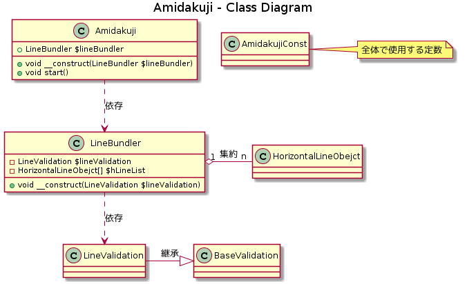

# Kinoue/Amidakuji

## クラス図

生成ツールについては[plant_text.md](./plant_text.md)を参照

## クラス解説

#### Amidakuji

入力、計算、出力処理のルーティングを行うクラス。

#### LineBundler

線の情報の受け渡しの処理を行うクラス。  
保有している線の情報を条件に応じて返すロジック処理を持つ。

#### LineValidation

入力値の検証を受け持つクラス。  
親クラスのBaseValidationに汎用的な検証処理を持ち、
仕様による検証処理をLineValidationで行う。

#### AmidakujiConst

あみだくじの仕様上の定数を定義するクラス。

## APIドキュメント

* [api/index.html](../api/index.html) 参照。
